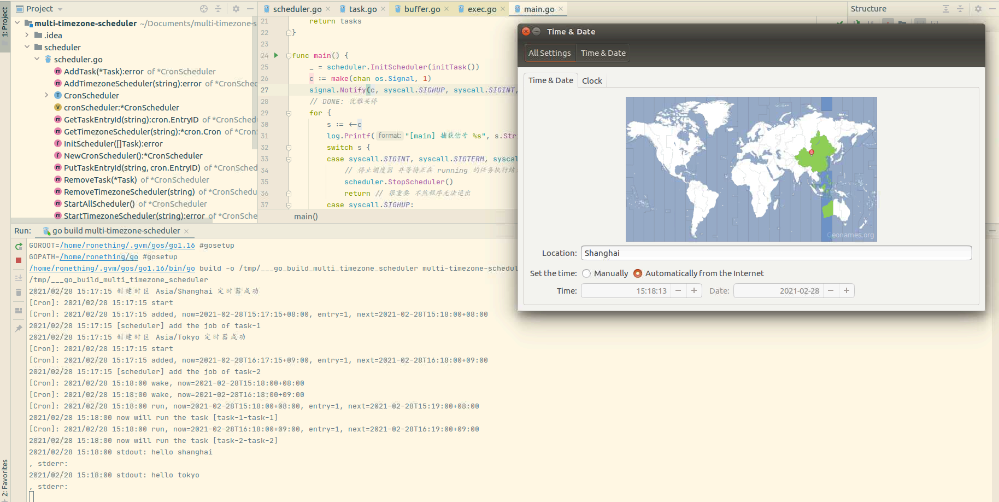

<!-- START doctoc generated TOC please keep comment here to allow auto update -->
<!-- DON'T EDIT THIS SECTION, INSTEAD RE-RUN doctoc TO UPDATE -->
**Table of Contents**  *generated with [DocToc](https://github.com/thlorenz/doctoc)*

- [multi-timezone-scheduler](#multi-timezone-scheduler)
  - [sample](#sample)
  - [Acknowledgment](#acknowledgment)

<!-- END doctoc generated TOC please keep comment here to allow auto update -->

## multi-timezone-scheduler

### sample

### Acknowledgment

- [cronv3](https://github.com/robfig/cron/v3)
